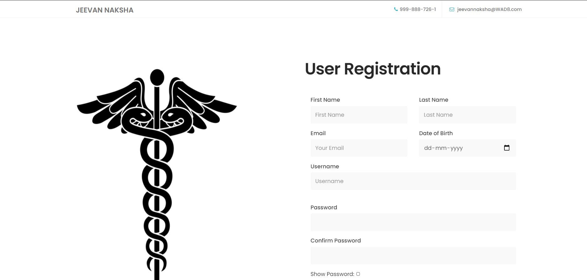
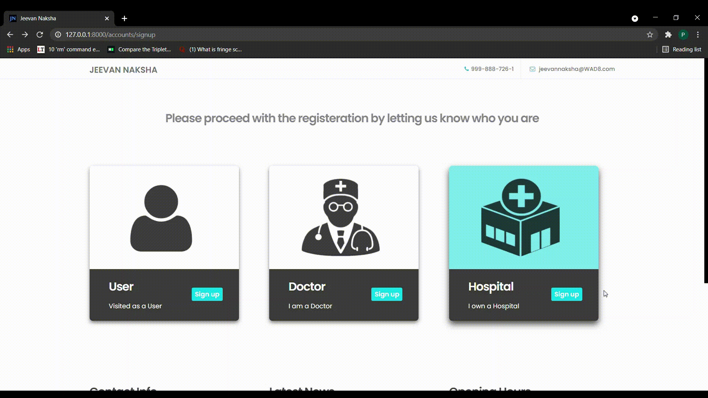
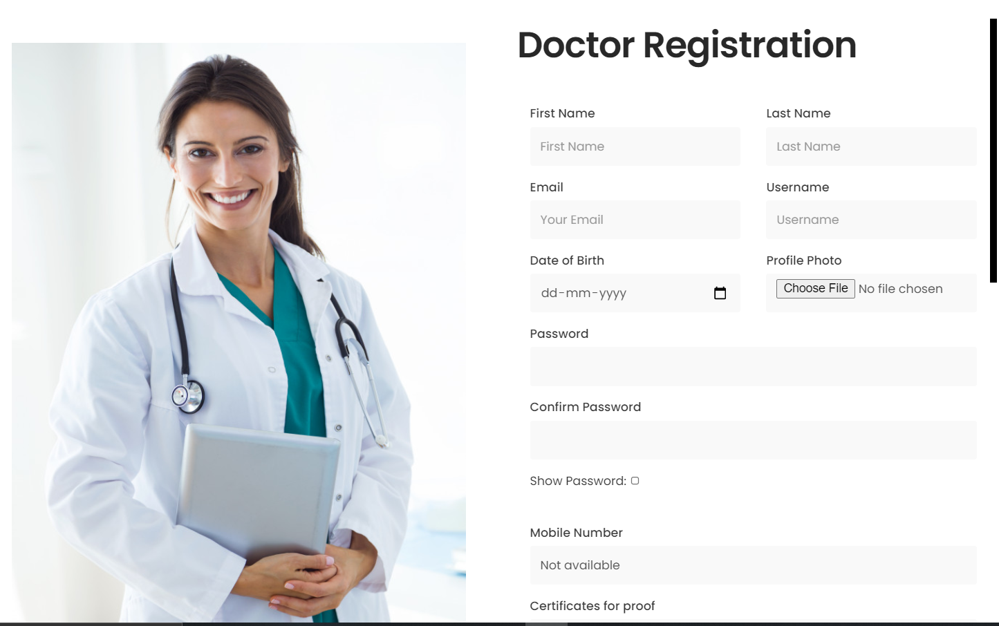
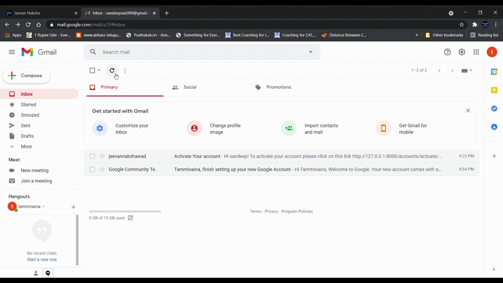
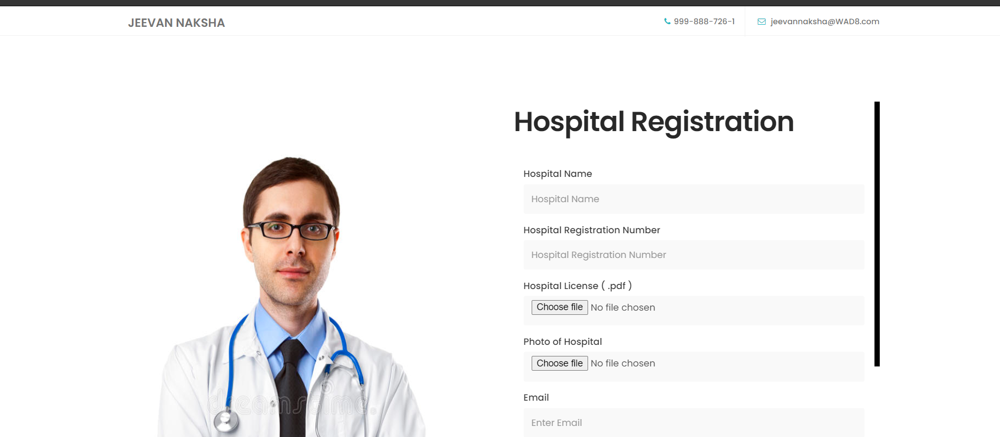
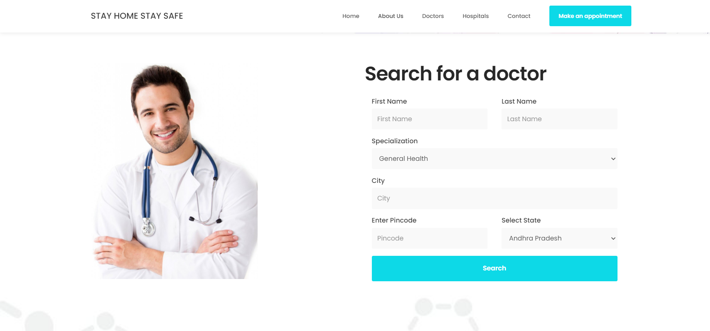
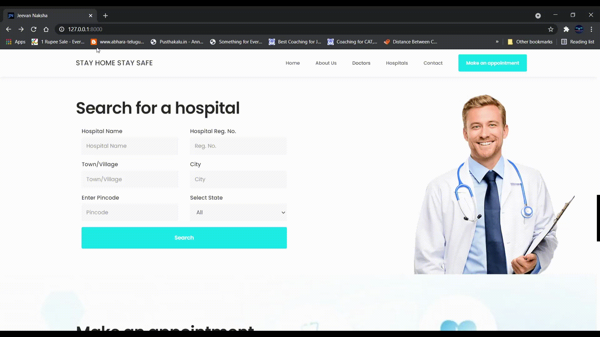
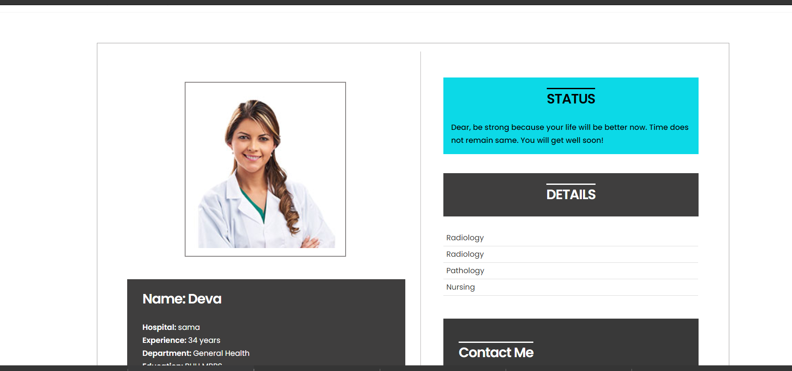
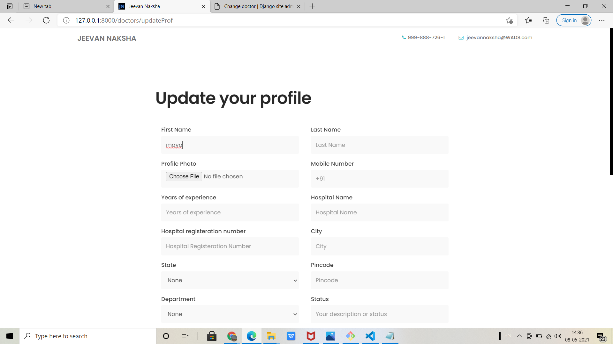

# Best Doctors & Hospitals Tracker

* Best doctors and hospitals tracker is the name of the project we have built and the name of the website is ```JEEVAN NAKSHA```.
* In our website you can register in three ways :-
   1. You can register as an User if you are a normal user/patient.
   2. You can register as a Doctor if you are a Doctor.
   3. You can register as a Hospital if you are a Hospital.
* In recent days, online mode is very common in every industry and many people or customers are willing to use the online mode to complete their work.
* It's been a hard time for some users who are searching for some best doctors or hospitals nearby them, so that they can save their effort of searching via offline mode.
* Our Website ```JEEVAN NAKSHA``` will provide the users this facility to search for the doctors or hospitals near by them.
* User can even have an **appointment** with a particular doctor they like from our website.
* Every section of our website will be explained in the following [Documentation](#documentation).

# Documentation
* [Project-Installation](#Project-Installation)
* [Project-Database](#Project-Database)
* [Authentication](#Authentication)
* [Registeration](#Registeration)
* [Search-Doctors](#Search-Doctors)
* [Search-Hospitals](#Search-Hospitals)
* [View-Profiles](#View-Profiles)
* [Update-Profiles](#Update-Profiles)
* [Reviews/Ratings](#Reviews/Ratings)
* [Make-Appointment](#Make-Appointment)
* [Contributers](#Contributers)

## Project-Installation
### Project Environment
#### Following are the list of softwares required for the environment.
* Python 3 or more
* Django 3 or more
* pycopg package from python
* pillow package from python
* HTML5, CSS, Node.js Support
* Version control (Git, Github)
* Postgre sql server and PgAdmin
### Installation
#### Step-1 
Clone this repository **[link](https://github.com/WAD-Team-Alpha/Hospital_Review_System.git)** using this command in your terminal/command prompt.
```
git clone https://github.com/WAD-Team-Alpha/Hospital_Review_System.git
```
#### Step-2 
Navigate to public folder and create a python file with name **email.py**.\

#### Step-3 
Inside the **email.py** file create the list of variables mentioned below and assign them accordingly.
* ```EMAIL_HOST_USER```     This variable is used to store the **email** of the website
* ```EMAIL_HOST_PASSWORD``` This variable is used to store the **password** for the email of the website
* ```EMAIL_HOST```          This variable is used to mention the type of host **In our case we use smtp.gmail.com**
* ```DEFAULT_FROM_EMAIL```  This variable stores the **default email** used by the website
* ```DB_PASSWORD```         This is the password of the database used in the **settings.py** file in public folder
#### Step-4
Before you run the project, make sure that you apply all the migrations to your database. If you are using postgre sql use the following **command**
```
python manage.py sqlmigrate (App_name) (migration_number)
```
Here ```App_name``` is the name of the app which has the migration with migration number ``` migration_number ```
**Note:** that you should use the above command only if you are using the sql based database as your backend otherthan **sqlLite3** which is *default* one.
After you should migrate all the migrations using the following **command**.
```
python manage.py migrate
```
#### Step-5
After applying all the migrations, now its time to run the website. Make sure that you have your environment ready with all the mentioned softwares installed. In your command prompt/terminal run this command to start the **django server**.
```
python manage.py runserver
```

Hence the **installation** and setup of the project is **done completely**.
## Project-Database
### Our project has the ```database``` configuration of this type:

* A table for each ```User``` / ```Doctor``` / ```Hospital```.
* A table to store all the ```appointments``` of each user/patient
* A table to store the ```doctor reviews```
* A table to store the ```hospital reviews```

And here are the some of the code snippets of the Database Schema
``` python
DATABASES = {
    'default': {
        'ENGINE': 'django.db.backends.postgresql',
        'NAME': 'JNDB',
        'USER': 'postgres',
        'PASSWORD': DB_PASSWORD,
        'HOST': 'localhost',
    }
}
```
* In the above code, ```DB_PASSWORD``` is the password of the PGAdmin. As stated we have used the postgre sql database.
* All the models of the tables are available in the respective models.py file. A sample code of the models.py is shown below
``` python
class User(models.Model):
    FirstName = models.CharField(max_length=150)
    LastName = models.CharField(max_length=150)
    Username = models.CharField(max_length=150)
    Email = models.CharField(max_length=150)
    DateOfBirth = models.CharField(max_length=150)
    MobileNumber = models.CharField(max_length=10)
    def __str__(self):
        return self.Username
```
* In the above code, all the fields are given their respective abilities to work with, and the default value which it returns is its ```Username```.
* Please note that there are lots of models in our project other than the model which is shown above.
* With all these models and the Database used, we have setup our database sucessfully.
## Authentication

### How can a person signin. Follow these steps to signin:


* Press ```signin``` button to get signed in.
* Enter valid user credentials of your account and press ```sign in```.If you do not have an account, the create one by pressing on create one link. If you entered wrong credentials then you be redirected to ```signin fail page```.
* On successfull login you will get back to index page . here the header is different for different kinds of user like ```public```, ```doctors``` and ```hospitals```. For doctors and hospitals they will get view profile button inplace of logout button.
* if user is an doctor or hospital manager then they get an ```view profile``` button.


### Here is a small code snippet of the implementation of this feature:
``` python
def signin(request):
    '''
    this function is used to validate the user credentials and then get signed in the eligible 
    users of the web app
    '''
    # getting credentials using POST method
    if request.method == 'POST':
        username = request.POST['username']
        password = request.POST['password']
        
        # below line will validate credentials and store the returned data of the user
        user = auth.authenticate(request, username=username, password=password)
        
        # based on returned value user get logged .
        if user is not None:
            auth.login(request, user)
            return redirect('index')
        else:
            return render(request, 'signin_fail.html')
    else:
        return render(request, 'signin.html')
```

* All the explanation is already added in the code as ```comments```. You can refer to them for further understanding.
* This code basically shows the functionality of ```signin``` and its whole process.

***

###  Steps to get signed out
* For user to get signed out you need to press `signout` button in home page.
* Where as for doctors and hospitals you need to navigate to their profile page and then press on **signout** button to get signed out.


#### Here is a code snippet of the ```signout``` process: 
``` python
def signout(request):
    '''
    This function will helps the user to get logged out of the website,
    this function will run only when the user presses logout button.
    '''
    auth.logout(request)
    messages.success(request, "Signed out successfully")
    return redirect('index')
```

***

### What happens when a person forgets their ```password```. Here is the process for it.

* In the above screenshot we can see a ```forgot password?``` section. Clicking on that will redirect you to a page where we will ask your ```email``` which is linked with your **account**.
* Then after entering your mail, a ```password reset``` **link** will be sent to your **mail** Click on that link.
* After clicking on that link, Set your ```new password``` and click reset button.
* There you go. You have sucessfully **resetted your password**.
* Here is a small demonstration of the process.


* Forgot Password completely implements the function which is provided by ```django``` completely.
* Not necessary to implement it by ourselves, just we must add some url's in the main ```urls.py``` which is shown below.
``` python
path('password_reset/', auth_views.PasswordResetView.as_view(template_name='Email.html'), name='password_reset'),
path('password_reset_sent/', auth_views.PasswordResetDoneView.as_view(template_name='password_reset_sent.html'), name='password_reset_done'),
path('reset/<uidb64>/<token>/', auth_views.PasswordResetConfirmView.as_view(template_name='forgot_password.html'), name='password_reset_confirm'),
path('password_reset_complete/', auth_views.PasswordResetCompleteView.as_view(template_name='password_reset_complete.html'),name='password_reset_complete'),
```

* As shown above, each url refers to each step taken in the forgot password like
   * ```Entering email details```
   * ```Sending the Password reset link```
   * ```Changing the password```
   * ```Password reset confirmation page```
* These are the main steps in the urls needed to implement the forgot password function.


## Registeration
### A person can register in our website as follows
* If the person is a user or a patient, he can register using ```User Registeration``` form
* If the person is a doctor, he can register using ```Doctor Registertion``` form
* If the person has a hospital, he can register using ``` Hospital Registeration ```form
### Navigating to Signup page
* The page looks something **like this**


* Below is a small **Illustration** of how to navigate to signup page


* You can register in any three of them depending on your ```profession```

***

### How to register in the website as a user
Below are the steps for registering as a ```User```:
* From Main page,go to ```SignIn``` page.
* For Registering as a new User click ```SignUp``` below forgot password.
* In signup page, click ```Signup as a user```.
* After clicking SignUp as a User, you will get a ```Registration form``` as shown below.




* In User Registration Form, Fill all the details asked in the form and make sure the requirements are fulfilled like in Password it should contain a ```Capital letter and some special characters.```
* After filling all details required in the form click on ```Register Button```.
* After registering successfully, you will redirect to the ```main page``` with a message showing **Activate your account after clicking the link sent to your mail**.




* Now, go to your ```registered mail``` and you can find a mail from ```jeevannakshawad``` with a **activation link** for your account.
* Click on that link, now you are succesfully registered as a User and you will be redirected to the ```main page``` with the message **Account Activated Succesfully**.


##### Now you're succesfully registered as a User.

#### Let's look at the code of implementation: 
* We can access all the required information from the form and use them for the registeration process.
``` python
def userReg(request):
    if request.method == "POST":
        # Creating an instance of the user registeration form for validation
        userform = UserForm(request.POST, request.FILES)
        
        # Accessing all the required information for authentication and validation
        username = request.POST['Username']
        password = request.POST['psw']
        email=request.POST['Email']
        user = User.objects.create_user(username=username, password=password, email=email)
        user.is_active = False
        user.save()
        # Save the Data to the Database 
        userform.save()
```
* Please note that the above code is not the final code, it just displayed just for your understanding, if you want the whole optimal code, you can visit the respective views.py file
* We need to send a mail to the user so that he can activate his account, below is the code snippet which performs this action.
``` python
subject = "Activate Your account"
uidb64 = urlsafe_base64_encode(force_bytes(user.pk))
token = token_generator.make_token(user)
domain = get_current_site(request).domain
link = reverse('activate', kwargs={'uidb64': uidb64, "token": token})
activate_url = 'http://'+domain+link
body = "Hi " + username + "!\n To activate your account please click on this link\n" + activate_url

 # Sending the account activation link to the user's mail
Email = send_mail (
    subject,
    body,
    "jeevannakshawad@gmail.com",
    [email],
    fail_silently=False
)
```

* After the account is activated by completing the email verification process, we can signin normally, here is the code snippet for this implementation.
``` python
if user.is_active:
    messages.success(request, 'Account is already active')
    return redirect('index')
user.is_active = True
user.save()
auth.login(request, user) # he will be logged in for the first time sucessfully
```

#### Below are the some of errors you can encounter when you register
* If ```Password``` and ```Confirm Password``` are not same it will show **Passwords dont match** error. So make sure you enter the both passwords correctly.
* If any user registered with the ```same username``` before you register, it shows **UserName Already Exists**. So, Try with a different username.
* If any user registered with the ```same email``` before you register or if you're registering 2nd time with the same email, it shows **Email already Exists** error. So, make sure you enter your email correctly.

***

### How to register in the website as a Doctor

Below are the steps for registering as a ```Doctor```:
* From Main page, go to ```SignIn page```.
* For Registering as a new Doctor click ```SignUp``` button situated below ```forgot password``` option.
* In signup page, click Signup as a ```Doctor```.
* After clicking SignUp as a Doctor, you will get a ```Registration form``` as shown below.




* In Doctor Registration Form, Fill all the details asked in the form and make sure the requirements are fulfilled like in Password it should contain a Capital letter, a small letter and some special characters and a ```minimum length of 8 charecters```.
* After filling all details required in the form click on ```Register Button```.
* After registering successfully, you will redirect to the ```main page``` with a message showing **Activate your account after clicking the link sent to your mail**.


* Now, go to your registered mail and you can find a mail from ```jeevannakshawad``` with a activation link for your account.
* Click on that link, now you are succesfully registered as a ```Doctor``` and you will be redirected to the main page with the message **Account Activated Succesfully**.




#### Now you're succesfully registered as a Doctor.

#### Coming to the code of implementation part
* The Doctor registeration process implementation is **exactly** same as the user registeration process, you can refer to the user registeration process for clear undersatnding, for now i am attaching the small snippet of the code just for your reference.

``` python
if doctorForm.is_valid():
   # Create user
   user = User.objects.create_user(username=username, password=password, email=email)
   user.is_active = False
   user.save()

   # Save the Data to the Database 
   doctorForm.save()
```

#### Below are the some of errors you can encounter when you register
* If Password and Confirm Password are not same it will show ```Passwords dont match``` error. So make sure you enter the both passwords correctly.
* If any user registered with the same username before you register, it shows ```UserName Already Exists```. So, Try with a different username.
* If any user registered with the same email before you register or if you're registering 2nd time with the same email, it shows ```Email already Exists``` error. So, make sure you enter your email correctly.

***

### How to register in the website as a Hospital 
#### It is hospital registeration form ,hospital will register here
* From Main page, go to SignIn page.
* For Registering as a new Hospitals click SignUp button situated below forgot password option.
* In signup page, click Signup as a Hospitals.
* After clicking SignUp as a hospital, you will get a Registration form as shown below.



* In hospital Registration Form, Fill all the details asked in the form and make sure the requirements are fulfilled like in Password it should contain a Capital letter, a small letter and some special characters and a minimum length of 8 charecters.
* After filling all details required in the form click on Register Button.

* After registering successfully, you will redirect to the main page with a message showing Activate your account after clicking the link sent to your mail.

#### Coming to the code of implementation part
* The Hospital registeration process implementation is **exactly** same as the user registeration process, you can refer to the user registeration process for clear undersatnding, for now i am attaching the small snippet of the code just for your reference.

``` python
if hospform.is_valid():
   # Create user for the hospital
   user = User.objects.create_user(username=username, password=password, email=email)
   user.is_active = False
   user.save()

   # Save the Data to the Database 
   hospform.save()
```

### It is demo how to register here 


 * After registering successfully, you will redirect to the main page with a message showing Activate your account after clicking the link sent to your mail.
 * Click on that link, now you are succesfully registered as a Doctor and you will be redirected to the main page with the message Account Activated Succesfully.


## Search-Doctors

### You can Search by the following details of the ```doctors```:
  - ```First Name``` of the doctor
  - ```Last Name``` of the doctor
  - ```Specialization``` of the doctor
  - ```City``` where the doctor works
  - ```State``` where the doctor works
  - ```Pincode``` of the place where the doctor works
  
  


* It is not necessary to know all the details listed above to search a ```Doctor```.
* You can search for a **doctor/doctors** by their ```first name``` or by their ```last name``` or ```City``` in which the doctor works.
* You can also search for **doctor/doctors** through the ```Pincode``` of a place where the doctor works.
* You can also see list of **Doctors** working in a particular state by selecting that ```state```.
* You can also see list of **Doctors** working in all ```States``` by selecting All option in search bar.
* You can also search for a doctor by their ```Specialization```.
* After entering details in the **doctor search bar** click on **Search** Button which will redirect you to **Doctor Search Results page**.
* If there are doctors found, you can see a ```list of with some information``` like Doctors ```Name,Department,Works at and Pincode and Ratings``` of the **doctor**. 
* If no doctors Found, then it shows **No Doctors Found**.


#### Now talking about the code of implementation of this feature
* We will be filtering the doctor table based on the data we have recieved from the user as follows
* Below is a code snippet where the filtering happens which is the overall filtering, in that we will be first sorting the doctors according to the firstname
``` python
def searchRes(request):
    #Storing all the objects of the Doctor which are imported from models in queryset_list and are ordered by their FirstName
    queryset_list = Doctor.objects.order_by('-FirstName')

    #Assigning variable State_result for the States which are imported from choices
    State_result = States
    # print(State_result)
    dept_result = Departmen
```

* After that we will be filtering all the doctors based on the ```firstname```, ```lastname``` etc. Below is a small snippet of that kind of implementation
``` python
if 'first_name' in request.GET:
        #Storing first_name in FirstName
        FirstName = request.GET['first_name']
        #if FirstName exists then we are filtering the required FirstName from database and storing it in queryset_list and __iexact is used for case insensitive match for FirstName.
        if FirstName:
            queryset_list = queryset_list.filter(FirstName__iexact = FirstName)
```
* Please note that in the above code snippet the filtering is shown only for the ```firstname``` part, remaining all also follow the same pattern of filtering.
* Finally we will be storing the optimal result in a dictionary and will be rendering it inside the ```results bar```.

``` python
dict = []
    for result in queryset_list:
        Result = result
        #Extarcting Key value for the State and Deaprtment from choices.py 
        State_result = States[result.State-1][1]
        dept_result = Department[result.Department-1][1]
        #Storing the above three values in a Dictionary
        res={
            'result': Result,
            'State_result' : State_result,
            'dept_result': dept_result,
        }
        #Appending res to dict.
        dict.append(res)
```

* And we will be displaying all the possible doctors in the results bar, so that the user can select his ```own choice```.

#### **You can also view the Doctor Profile by clicking View Profile Button**.

## Search-Hospitals


### This feature helps the user to search for hospital using some filters.
#### The filters availble to search are:-
- ```Hospital name```
- ```Hospital registration number```
- ```Town/vilage for area```
- ```City```
- ```Pincode```
- ```State```


### Search results
#### After pressing the search button, you will be directed to the search results page.
In this page you can see the ```cards``` of the hospitals based on filters applied. The information given on cards is as follows:-
- ```Profile photo``` of hospital to the left most
- ```Ratigs``` to the rightmost
- ```Location```
- ```Pincode```
- ```Chief medical officer```
- ```Phone number```
- ```Email```



#### Talking about the code of implementation
* The hospital search bar works exactly the same as the doctor search bar, and hence you can refer to the doctor serach bar code, though a small snippet of code is attached below for your reference.

``` python
dict = []
    for result in queryset_list:
        Result = result
         #Extarcting Key value for the State from choices.py 
        State_result = States[result.State-1][1]
        #Storing the above two values in a Dictionary
        res={
            'result': Result,
            'State_result' : State_result,
        }
        #Appending res to dict.
        dict.append(res)
```

### You can also view the hospital prifile by clicking 'view profile' button

## View-Profiles

### Doctors-Profile
#### It is doctor profile , doctor can view profile and other how register in website they can view doctor profile using search bar 
 * From Main page, go to view profile.
 * See all doctor detail  



 * Doctor name ,hospital to belong
 * Specicalistion , Exprience 
 * Time of meet the patient  

#### Coming to the code of implementation
* Implemeting this feature is not a lengthy one, but it has just a fetching process from the database and rendering it in the profile page.
* Below is a small snippet of that code.
``` python
def docProf(request, doctor_id):
    '''
    this function will helps the doctor profile html page to access all the dynamic data 
    from the database. we get doctor_id from html page
    '''
    #checking whether doctor  exists or not
    doctor =get_object_or_404(Doctor, pk= doctor_id)
    queryset_list = DocReview.objects.order_by('-review_date').filter(doctor = doctor)
```

#### It is doctor profile demo 
 * According to rating and review we can judge the service


### Hospitals-Profile
#### It is Hospitals profile , Hospitals can view profile and other how register in website they can view Hospitals profile using search bar
 * From Main page, go to view profile.
 * See all Hospital detail  

 

  * Hospital name , Facilty in hospital
  * Doctor team, chief of doctor 
  * Update profile like hospital name, doctor team

#### Coming to the code of implementation
* Implemeting this feature is not a lengthy one, but it has just a fetching process from the database and rendering it in the profile page.
* Below is a small snippet of that code.

``` python
def hosProf(request, hospital_id):
    '''
    this function will helps the hospital profile html page to access all the dynamic data 
    from the database. we get hospital_id from html page
    '''

    #checking whether doctor  exists or not
    hospital =get_object_or_404(Hospital, pk= hospital_id)
    # doctor search list which belong to this hospital 
    doctor_list = Doctor.objects.all().filter(HospitalRegisterationNumber=hospital.HospitalRegisterationNumber)
    # print(doctor_list)
    queryset_list = HosReview.objects.order_by('-review_date').filter(hospital = hospital)
```

#### It is Hospitals profile demo


 * According to rating and review we can judge the service

## Update-Profiles

### hospital and Doctor can update their profile
 * From profile page, go to update button.
 * Check use is doctor then update his profile and if it is user they can not update
 * Check use is Hospital then update his profile and if it is user they can not update

* update Doctor and Hospital name
* update Profile photo
* update Specicalistion , Exprience

#### Talking about the code of implementation
* First we just need to collect all the data required to update the profile and just need to update the changes in the database
* Below is the snippet to collect the data
``` python
def updateProf(request):
    if request.method == "POST":
        flag = 0
        data = request.POST
        files = request.FILES.get('profilePhoto')
        fs = FileSystemStorage()

        try:
            fs.save("DoctorPhotos/"+files.name, files)
            Path = "DoctorPhotos/"+str(files.name)
        except AttributeError:
            flag = 1

        doctor = Doctor.objects.all().filter(Username=request.user.username).get()
```
* Then we just needed to check the details which have changed and which have not changed according to the database.
* To do this, we just implement a ```if else``` for all the data.
* Below is the sample code for this, please note that fname is ```firstname```.
``` python
if data['fname'] == "":
            fname = doctor.FirstName
        else:
            fname = data['fname']
```
* In the same way we will be updating all the details and store them in their respective variables
* All the variables are then used to update the profile as shown below.
``` python
doctorUpdated = Doctor.objects.all().filter(Username=request.user.username).update(
   FirstName = fname,
   LastName = lname,
   ProfilePhoto = profilePhoto,
   MobileNumber = mobilenum,
   YearsOfExperience = yoe ,          
   HospitalName = hospname,
   HospitalRegisterationNumber = hospRegNum,
   City = city,
   State = state,
   Pincode = pincode,
   Department = dept,
   Description = desc,
   Achievements1 = ach1,
   Achievements2 = ach2,
   Achievements3 = ach3,
   Achievements4 = ach4
)
```
* Note that the code show above is for the doctor update profile, it is similar for hospital profile also.
* After then we just need to save the information and redirect him to his updated profile page as shown in below code snippet.
``` python
doctor_id = str(doctor.id)
messages.success(request, "Updated profile sucessfully")
return redirect('/doctors/'+doctor_id)
```
### It is  update  Demo

* After update profile redirect in profile and get massage to update profile 

## Reviews/Ratings

### How to view reviews and ratings

* For viewing reviews and Ratings you need to scroll down in the profile page for a perticular doctor/hospital. Press ```load more``` button to load more reviews.


* You can also see ```ratings summary``` in the same page.Here you can see the details like number of reviews added and average rating and also you can observe count of each rating added.


### How to add ratings an reviews


* In profile pages, you can add reviews and ratings in allotted slot, but you must get **logged in before hand**. otherwise page will shown like this.


* Another important thing is you must **signed with an user account** to add an review. After successful signin you can add review.

### Talking about the code of implementation
* All the stars are accessed from the backend and stored in such a way that we can keep track of each start as shown below.
``` python
doctor = Doctor.objects.all().filter(Username=doctor_name).get()
# adding review to database
reviewed = DocReview(doctor=doctor, user=user, star_rating=star_rating,non_rating=non_rating, review=review)
reviewed.save()
# filtering all the reviews of the target doctor
queryset_list = DocReview.objects.order_by('-review_date').filter(doctor = doctor)
```

* After that we just needed to save them to the database 
* When we wanted to render them into the profile page, the following process is implemented

```python
five_stars = 0
    for review  in queryset_list:
        if review.star_rating == "12345":
            five_stars = five_stars + 1
    four_stars = 0
    for review  in queryset_list:
        if review.star_rating == "1234":
            four_stars = four_stars + 1
    three_stars = 0
    for review  in queryset_list:
        if review.star_rating == "123":
            three_stars = three_stars + 1
    two_stars = 0
    for review  in queryset_list:
        if review.star_rating == "12":
            two_stars = two_stars + 1
    one_stars = 0
    for review  in queryset_list:
        if review.star_rating == "1":
            one_stars = one_stars + 1
```
* The process is big huge due to which all the code cant fit in the documentation, You can visit the file and inspect there as well.


* After sucessfully adding review you can see your review in the reviews section (updates instantly).


## Make-Appointment

### Only a patient can have an appointment with a doctor
* Patient first needs to give the username of the doctor by viewing the ```username``` from the respective ```Doctor profile```
* Then he must mention the ```date of the appointment```
* And then mention the ```message``` required to convey his/her problem to the doctor
* Once the appointment is done, An email is sent to **both the respective doctor and the user** just for the confirmation.
* And then, the doctor will take up the converstaion with the user. This is the complete process of the appointment.


#### Lets now talk about the code of implementation
* After collecting all the required details, the email will be sent to the doctor and the user.
* Below is the implementatio of the process.
``` python
def MakeAnAppointment(request):
    # Accessing all the required info for validation
    if request.method == "POST":
        DoctorUsername = request.POST["dname"] # accessing the doctors username
        DateOfAppointment = request.POST["date"] # accessing the date of appointment
        additionalMessage = request.POST["message"] # Some additional message is accessed here

        # Checking whether the user is signed in or not
        if not request.user.is_authenticated:
            messages.error(request, "Please Signin")
            return redirect('index')        

        # retrieving the user and doctor
        user = User.objects.all().filter(Username=request.user.username).get()
        doctor = Doctor.objects.all().filter(Username=DoctorUsername).get()
```
* We need to save the appointment in the database respectively and proceed to send the mail
``` python
appointment = Appointment(user=user, doctor=doctor, dateOfAppointment=DateOfAppointment, AdditionalMessage=additionalMessage)
appointment.save()
```
* After that we need to send the mail to both the doctor and the user as well
``` python
userEmail = send_mail (
       userSubject,
       userBody,
       "jeevannakshawad@gmail.com",
       [userEmail],
       fail_silently=False
)
```
* With this the appointment is sent sucessfully
## Contributers
<table>
  <tr>
    <td align="center"><a href="https://github.com/surya0180"></a><br /><sub><b>Surya Teja</b></sub></td>
    <td align="center"><a href="https://github.com/bannu0snake"></a><br /><sub><b>Mahaboob</b></sub></td>
    <td align="center"><a href="https://github.com/prathyush11"></a><br /><sub><b>Prathyush</b></sub></td>
    <td align="center"><a href="https://github.com/sekharsa"></a><br /><sub><b>Sekhar</b></sub></td>
    <td align="center"><a href="https://github.com/satyamsingh-sg"></a><br /><sub><b>Satyam Kumar</b></sub></td>
  </tr>
</table>
